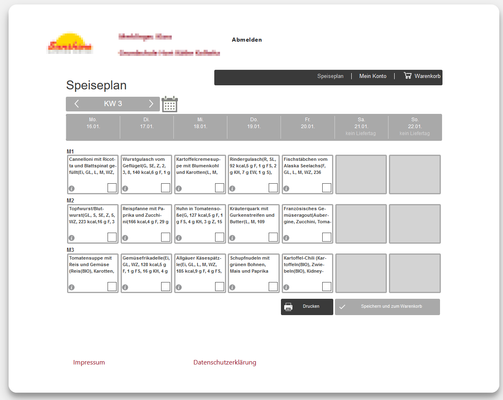
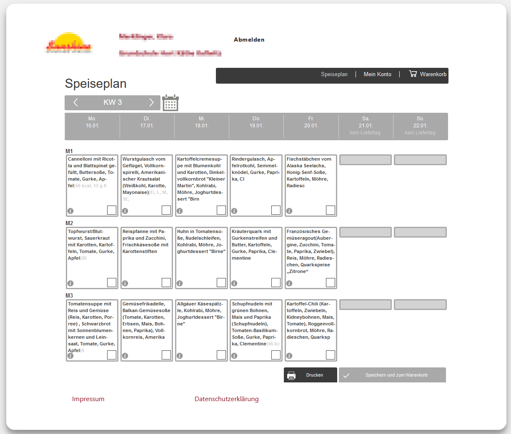
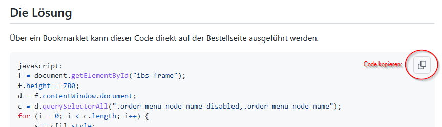
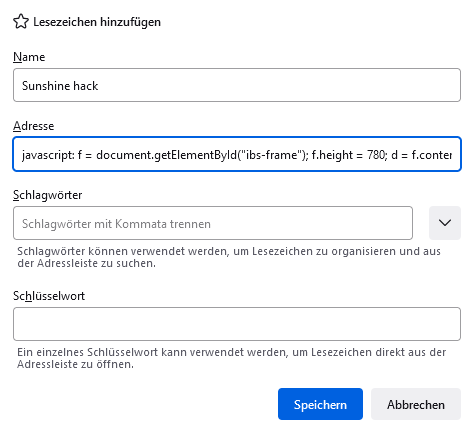

# Sunny hack

Ein Anbieter für Schulessen stellt den Speiseplan auf seiner Seite so dar:



Hierbei habe ich als Anwender diese Probleme:
* Die Darstellung bricht zu früh ab, es fehlen wesentliche Informationen.
* Die Gerichte sind schlecht leserlich durch lange Listen von Nährwerten und Zusatzstoffen.

Es gibt eine Detailansicht, die ist aber nur für einzelne Tage verfügbar, ist ebenfalls unleserlich und bricht bei
längeren Beschreibungen vor dem Nachtisch ab.

## Wie kommen wir nun an eine lesbare Übersicht:

Wie sich herausstellt, ist die Langfassung der Essenbeschreibung in den Zellen enthalten und kann also durch eine
Anpassung des CSS sichtbar gemacht werden.
```javascript
let c = document.querySelectorAll(".order-menu-node-name");
for (let i = 0; i < c.length; i++) {
    c[i].style.maxHeight = "none";
}
c = document.querySelectorAll(".order-menu-node");
for (let i = 0; i < c.length; i++) {
    c[i].style.height = "auto";
}
```

Die langen Listen von Extrainformationen lassen sich mit einer RegEx rausfiltern.
```javascript
c = document.querySelectorAll(".order-menu-node-name > span");
for (let i = 0; i < c.length; i++) {
    c[i].innerHTML = c[i].innerHTML.replace(/\(([A-Z0-9]{1,2}, .*?|Ei, .*?|BIO)\)/g, "")
}
```

## Die Lösung

Über ein Bookmarklet kann dieser Code direkt auf der Bestellseite ausgeführt werden.

```javascript
javascript:
f = document.getElementById("ibs-frame");
f.height = 780;
d = f.contentWindow.document;
c = d.querySelectorAll(".order-menu-node-name-disabled,.order-menu-node-name");
for (i = 0; i < c.length; i++) {
    s = c[i].style;
    s.maxHeight = "none";
    s.minHeight = "144px"
}
c = d.querySelectorAll(".order-menu-node-disabled,.order-menu-node");
for (i = 0; i < c.length; i++) {
    c[i].style.height = "auto"
}
c = d.querySelectorAll(".order-menu-node-name>span,.order-menu-node-name-disabled>span");
for (i = 0; i < c.length; i++) {
    t = c[i].innerHTML.replace(/<!--.*?-->/g, "");
    t = t.replace(/\(([A-Z0-9]{1,2}, .*?|Ei, .*?|BIO|BRB|[0-9]{1,3}g|[0-9]{1,3} kcal,.*?)\)/g, "");
    c[i].innerHTML = t.replace(/(\([^\)]*)$/g, "<span style='color:#ccc'>$1</span>")
}
console.log("ok");
```

## Das Ergebnis


## Cool. Das will ich auch!

Du bist auch Kunde bei diesem sonnigen Anbieter? Hier eine kurze Anleitung für diesen "Hack":

1. Kopiere den "Bookmarklet"-Code ([s.o.](#die-lösung)) in die Zwischenablage. 
2. Erstelle ein Lesezeichen und füge als Adresse den Code aus der Zwischenablage ein. 
3. Fertig. Jetzt gehe zu unserem Anbieter, logge Dich ein und wähle den Plan, dessen Darstellung Du manipulieren
   möchtest. Dann klickst Du auf das Lesezeichen.


